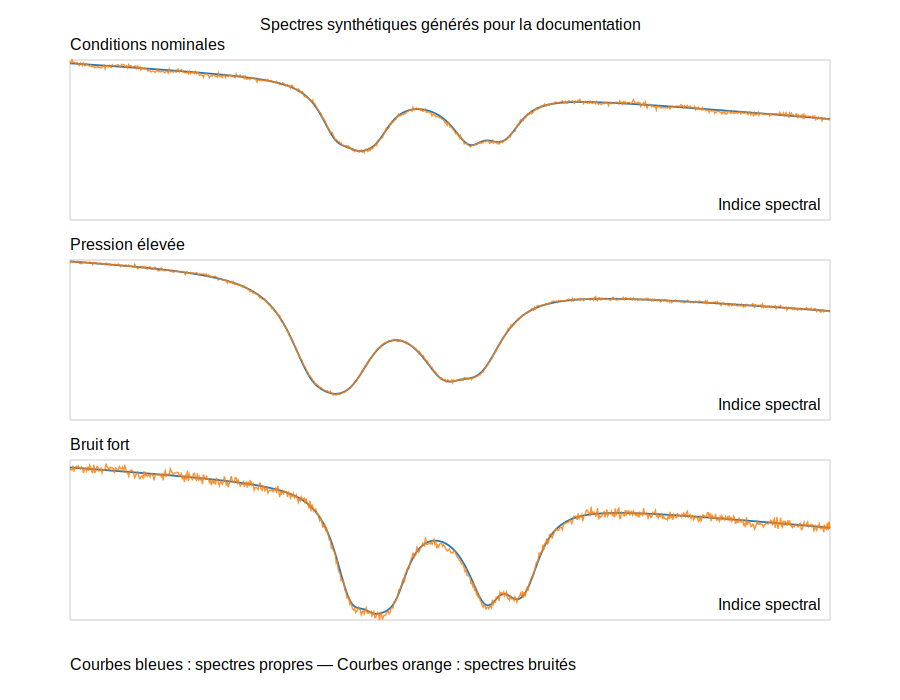

Tutoriel complet
================

Ce tutoriel montre, étape par étape, comment reproduire l'intégralité du
pipeline ``PhysAE`` :

1. construire les données synthétiques et visualiser les spectres générés ;
2. faire varier systématiquement tous les paramètres de génération ;
3. contrôler exhaustivement les options des étapes d'entraînement ;
4. explorer l'espace d'hyperparamètres avec Optuna.

Préparation
-----------

.. code-block:: python

   from physae.factory import build_data_and_model
   from physae.training import train_stage_A, train_stage_B1, train_stage_B2

   model, (train_loader, val_loader), metadata = build_data_and_model(
       config_path="physae/configs/data",
       config_name="default",
   )

   print("Dimensions des entrées attendues :", metadata["input_shape"])

La fonction :func:`physae.factory.build_data_and_model` lit le fichier YAML,
construit un :class:`~physae.dataset.SpectraDataset` pour l'entraînement et la
validation, et instancie :class:`physae.model.PhysicallyInformedAE` avec les
paramètres de base (taux d'apprentissage, refinements, film, etc.).

Construction détaillée des données
----------------------------------

``SpectraDataset`` accepte toutes les options nécessaires pour générer des
spectres réalistes à partir des transitions CH\ :sub:`4`. Les principaux
paramètres peuvent être modifiés directement via ``build_data_and_model`` ou en
instanciant le dataset manuellement.

* ``n_samples`` : taille du jeu d'entraînement/validation.
* ``num_points`` : longueur du maillage spectral.
* ``sample_ranges`` : intervalles ``(min, max)`` pour chaque paramètre physique
  (``sig0``, ``dsig``, ``mf_CH4``, ``baseline0-2``, ``P``, ``T``).
* ``with_noise`` / ``noise_profile`` : configuration complète des bruits
  additifs, multiplicatifs, dérives, franges et spikes.
* ``freeze_noise`` : gel du bruit pour des expériences parfaitement
  reproductibles.

Le dictionnaire ``metadata`` retourné par ``build_data_and_model`` expose déjà
la totalité de ces valeurs. Pour les modifier, fournissez un dictionnaire
``config_overrides`` conforme au YAML de base :

.. code-block:: python

   custom_data = {
       "n_points": 1024,
       "n_train": 12_000,
       "noise": {
           "train": {
               "std_add_range": [0.0, 0.02],
               "drift_amp_range": [0.0, 0.08],
           },
           "val": {"std_add_range": [0.0, 5e-06]},
       },
       "train_ranges": {
           "P": [350.0, 750.0],
           "T": [300.0, 320.0],
           "mf_CH4": [1.5e-06, 3.0e-05],
       },
   }

   model, loaders, metadata = build_data_and_model(
       config_name="default",
       config_overrides=custom_data,
   )

Pour visualiser l'effet de ces paramètres, le dépôt fournit
``scripts/plot_synthetic_spectra.py`` qui génère directement les spectres
net/bruité au format SVG sans dépendance externe. L'exécution

.. code-block:: bash

   python scripts/plot_synthetic_spectra.py

produit la figure suivante :

   Trois exemples de spectres où l'on fait varier pression, température,
   concentration en CH\ :sub:`4` et intensité des bruits.

Variation systématique des paramètres
-------------------------------------

Il est souvent utile d'explorer explicitement l'influence de chaque paramètre.
Le code ci-dessous balaye les plages de valeurs en surchargeant
``config_overrides`` à chaque itération (tous les paramètres du YAML sont
acceptés) :

.. code-block:: python

   from itertools import product

   pressures = [350.0, 500.0, 650.0]
   temperatures = [300.0, 308.15, 316.0]
   noises = [
       {"train": {"std_add_range": [0.0, 0.002]}},
       {"train": {"std_add_range": [0.0, 0.01], "fringe_amp_range": [0.0, 0.01]}},
   ]

   for P, T, noise_cfg in product(pressures, temperatures, noises):
       overrides = {
           "train_ranges": {"P": [P, P + 20], "T": [T, T + 5]},
           "noise": noise_cfg,
       }
       model, (train_loader, _), meta = build_data_and_model(
           config_name="default",
           config_overrides=overrides,
       )
       print(f"Dataset de {meta['train_size']} échantillons avec P~{P} Pa et T~{T} K")

Les combinaisons possibles incluent toutes les clés présentes dans
``physae/configs/data/*.yaml`` (intervalles de normalisation, listes de sorties
``predict_list``, configuration du modèle, etc.).

Entraînement par étapes
-----------------------

Étape A (pré-entraînement des têtes)
~~~~~~~~~~~~~~~~~~~~~~~~~~~~~~~~~~~

.. code-block:: python

   model = train_stage_A(
       model,
       train_loader,
       val_loader,
       epochs=20,          # surcharge optionnelle
       base_lr=2e-4,
       enable_progress_bar=True,
   )

Cette phase active ``train_base`` et ``train_heads`` (voir
:func:`physae.training.train_stage_custom`). Aucune étape de raffinement n'est
lancée (``refine_steps=0``).

Étape B1 (raffinement ciblé)
~~~~~~~~~~~~~~~~~~~~~~~~~~~~

.. code-block:: python

   model = train_stage_B1(
       model,
       train_loader,
       val_loader,
       refiner_lr=1e-5,
       delta_scale=0.12,
       film_subset=["T"],
   )

Seule la tête de raffinage est entraînée et les paramètres ``T`` sont utilisés
pour la modulation FiLM. Le raffinement applique un décalage de ``delta_scale``
sur les paramètres prédits.

Étape B2 (affinage conjoint)
~~~~~~~~~~~~~~~~~~~~~~~~~~~~

.. code-block:: python

   model = train_stage_B2(
       model,
       train_loader,
       val_loader,
       base_lr=3e-5,
       refiner_lr=3e-6,
       film_subset=["P", "T"],
   )

Tous les sous-modèles sont dégelés. Utilisez ``heads_subset`` si vous souhaitez
ne raffiner qu'une partie des sorties. Les YAML ``physae/configs/stages/*.yaml``
listent tous les arguments disponibles (``train_base``, ``train_film``,
``baseline_fix_enable``, etc.) et peuvent être modifiés via ``stage_overrides``.

Recherche d'hyperparamètres avec Optuna
---------------------------------------

.. code-block:: python

   from physae.optimization import optimise_stage

   stage_overrides = {
       "epochs": 10,
       "delta_scale": 0.12,
       "model": {
           "encoder": {"params": {"width_mult": 1.2}},
           "refiner": {"params": {"width_mult": 1.1}},
       },
   }

   data_overrides = {
       "n_train": 8192,
       "noise": {"train": {"p_drift": 0.2, "drift_amp_range": [0.0, 0.08]}}
   }

   study = optimise_stage(
       "B2",
       n_trials=15,
       metric="val_loss",
       data_overrides=data_overrides,
       stage_overrides=stage_overrides,
       show_progress_bar=True,
   )
   print("Meilleurs paramètres:", study.best_params)
   print("Score:", study.best_value)

La clé ``data_overrides`` accepte toute structure conforme au YAML. Les
paramètres préfixés par ``data.`` dans la section ``optuna`` des fichiers YAML
sont automatiquement redirigés vers ``data_overrides`` (voir
:func:`physae.optimization.optimise_stage`). L'argument ``stage_overrides``
permet d'ajuster n'importe quelle option du fichier d'étape avant que la
recherche Optuna ne commence.

Sauvegarde & reprise
--------------------

Les fonctions ``train_stage_*`` acceptent ``ckpt_in`` et ``ckpt_out`` pour
recharger un point de contrôle Lightning ou sauver les poids finaux. Combinez
les callbacks Lightning (ex. ``ModelCheckpoint``) avec ``callbacks=[...]`` pour
personnaliser vos expériences.
